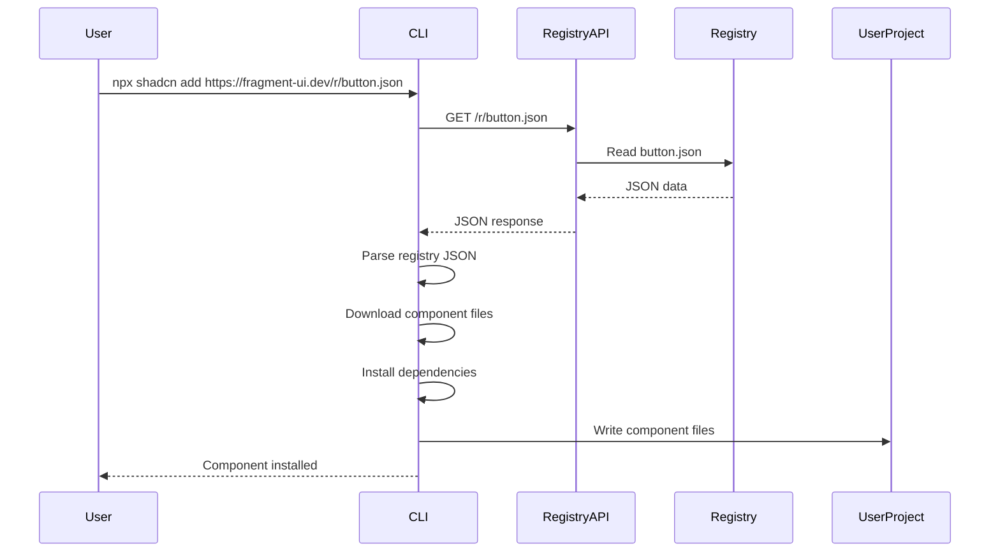
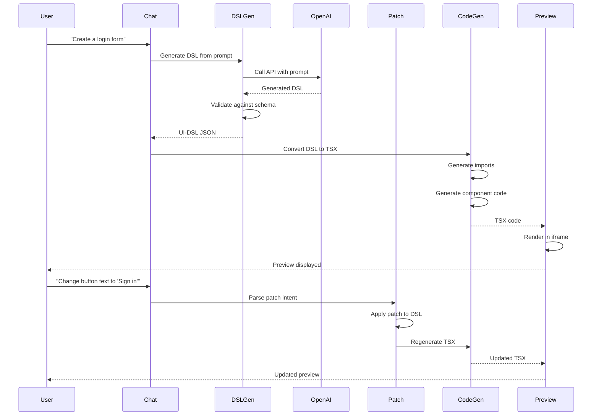
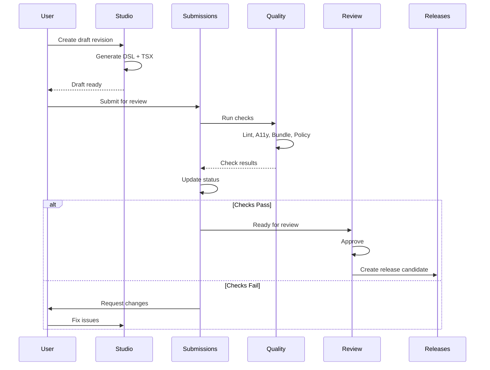
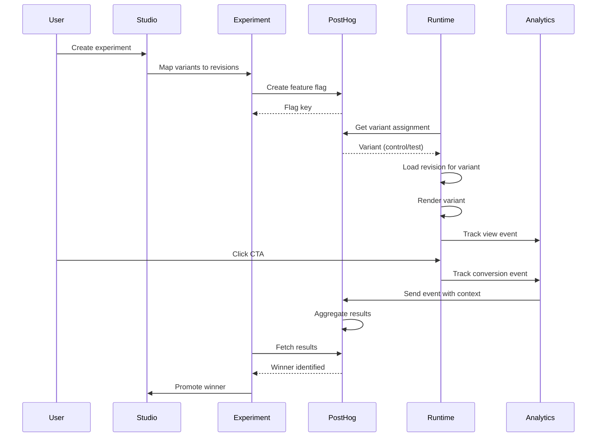

# Data Flow

**Purpose:** Understand how data flows through the system  
**Audience:** Engineers working on data flows  
**When to read:** When implementing features that involve data flow

---

## Overview

This document describes how data flows through Fragment UI, from user input to component generation to deployment.

---

## Key Data Flows

### 1. Component Installation Flow



**Key Points:**
- Registry JSON is static (no database)
- CLI handles all file operations
- User owns the code after installation

---

### 2. Studio Generation Flow



**Key Points:**
- DSL is source of truth
- TSX is derived from DSL
- Patches modify DSL, not TSX directly
- Preview updates without full regeneration

---

### 3. Submission Workflow Flow



**Key Points:**
- Revisions are immutable
- Quality checks are automatic
- Review is manual
- Releases created from approved submissions

---

### 4. Experiment Flow (A/B Testing)



**Key Points:**
- Variants map to revisions (not arbitrary code)
- PostHog handles variant assignment
- Events include experiment context
- Winner can be promoted to submission

---

## Data Storage

### Current State (File-Based)

- **Registry:** JSON files in `packages/registry/registry.json`
- **Submissions:** JSON files in `apps/demo/data/submissions.json`
- **Quality Data:** JSON files in `apps/demo/data/quality/`
- **Revisions:** In-memory (TODO: verify persistence)

### Future State (Database)

- **Assets:** Database table
- **Revisions:** Database table with immutable snapshots
- **Submissions:** Database table with state machine
- **Experiments:** Database table with PostHog integration

---

## Data Models

### Registry JSON

```json
{
  "name": "button",
  "type": "components:ui",
  "files": ["button.tsx"],
  "dependencies": ["@radix-ui/react-slot"],
  "registryDependencies": []
}
```

### UI-DSL v2

```json
{
  "type": "page",
  "id": "page_123",
  "sections": [
    {
      "type": "section",
      "kind": "hero",
      "id": "hero_123",
      "title": "Welcome"
    }
  ]
}
```

### Revision

```typescript
{
  revisionId: "rev_123",
  assetId: "asset_123",
  dslJson: { ... },
  tsxCode: "...",
  createdAt: "2025-01-XX",
  createdBy: "user_123"
}
```

---

## Gotchas

- **Immutability:** Revisions are immutable snapshots
- **DSL First:** DSL is source of truth, TSX is derived
- **File-Based:** Current storage is file-based, may need DB for scale
- **No Transactions:** File-based storage has no transactions

---

## Next Steps

- [Domain Model](./domain-model.md) - Core entities
- [Module Boundaries](./module-boundaries.md) - Module responsibilities
- [Operations Guide](../operations/README.md) - Production operations

---

**Last Updated:** 2025-01-XX

