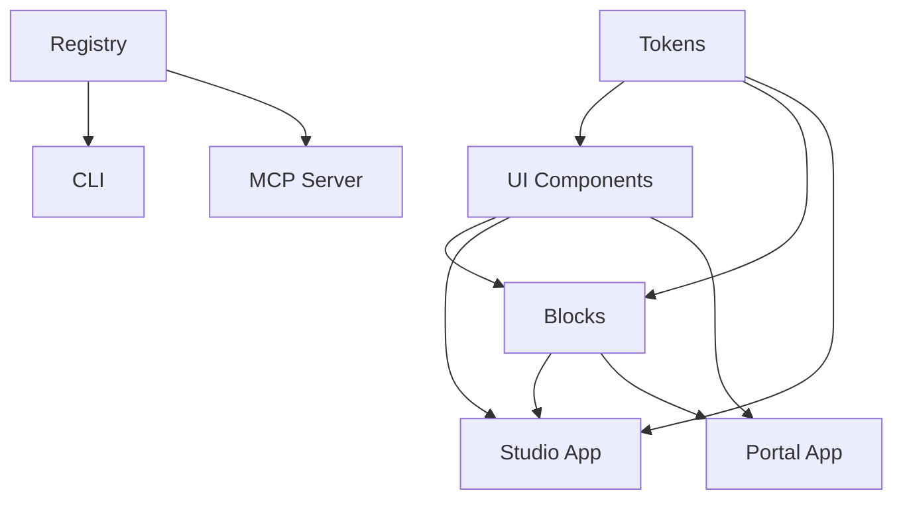

# Monorepo Structure

**Purpose:** Understand package organization and dependencies  
**Audience:** All engineers  
**When to read:** When adding packages or understanding build order

---

## Overview

Fragment UI uses a **pnpm workspace monorepo** managed by **Turborepo** for task orchestration.

```
fragment-ui/
├── apps/                    # Applications
│   ├── www/                 # Design System Portal
│   └── demo/                # Studio/Demo Application
├── packages/                # Reusable packages
│   ├── ui/                  # UI components (63+)
│   ├── blocks/              # Screen compositions
│   ├── tokens/              # Design tokens
│   ├── registry/            # Component registry
│   ├── cli/                 # CLI tool
│   ├── telemetry/           # Telemetry & analytics
│   ├── mcp-server/          # MCP Server for AI
│   ├── vscode-extension/    # VS Code extension
│   ├── ui-dsl/              # UI-DSL types & validation
│   ├── ui-native/           # React Native adapters
│   ├── patches/             # Upstream patch system
│   └── plugin-system/       # Plugin architecture
├── scripts/                 # Build & utility scripts
├── .github/                 # CI/CD workflows
└── docs/                    # Documentation
```

---

## Package Dependencies

### Dependency Graph



### Build Order

1. **tokens** - No dependencies
2. **registry** - No dependencies
3. **ui** - Depends on tokens
4. **blocks** - Depends on tokens, ui
5. **cli** - Depends on registry
6. **mcp-server** - Depends on registry
7. **apps** - Depends on ui, blocks, tokens

---

## Package Details

### Core Packages

#### `@fragment_ui/tokens`
- **Purpose:** Design tokens (colors, spacing, typography)
- **Output:** CSS variables, TypeScript types
- **Build:** `pnpm tokens:build`
- **Dependencies:** None

#### `@fragment_ui/ui`
- **Purpose:** UI components (63+ components)
- **Output:** React components, TypeScript types
- **Build:** `pnpm build`
- **Dependencies:** `@fragment_ui/tokens`

#### `@fragment_ui/blocks`
- **Purpose:** Pre-built screen compositions
- **Output:** React components
- **Build:** `pnpm build`
- **Dependencies:** `@fragment_ui/tokens`, `@fragment_ui/ui`

#### `@fragment_ui/registry`
- **Purpose:** Component registry (JSON files)
- **Output:** Registry JSON, validation
- **Build:** `pnpm registry:generate`
- **Dependencies:** None

### Tooling Packages

#### `@fragment_ui/cli`
- **Purpose:** CLI tool for component management
- **Commands:** `ds add`, `ds patch`, `ds plugin`
- **Dependencies:** `@fragment_ui/registry`

#### `@fragment_ui/mcp-server`
- **Purpose:** MCP Server for AI agent integration
- **Protocol:** Model Context Protocol
- **Dependencies:** `@fragment_ui/registry`

#### `@fragment_ui/vscode-extension`
- **Purpose:** VS Code extension for Fragment UI
- **Features:** IntelliSense, snippets, diagnostics
- **Dependencies:** `@fragment_ui/registry`

### Application Packages

#### `apps/www`
- **Purpose:** Design System Portal (public-facing)
- **Framework:** Next.js 15
- **Routes:** `/components`, `/docs`, `/tools`
- **Dependencies:** `@fragment_ui/ui`, `@fragment_ui/blocks`, `@fragment_ui/tokens`

#### `apps/demo`
- **Purpose:** Studio/Demo application
- **Framework:** Next.js 15
- **Routes:** `/studio`, `/submissions`, `/variants`
- **Dependencies:** All packages

---

## Workspace Configuration

### `pnpm-workspace.yaml`

```yaml
packages:
  - "apps/*"
  - "packages/*"
  - "scripts"
```

### `turbo.json`

Turborepo configuration for task orchestration:

```json
{
  "tasks": {
    "build": {
      "dependsOn": ["^build"],
      "outputs": ["dist/**", "build/**", ".next/**"]
    },
    "test": {
      "dependsOn": ["^build"],
      "outputs": ["coverage/**"]
    }
  }
}
```

---

## Build System

### Turborepo Tasks

- **`dev`** - Start development servers (no cache)
- **`build`** - Build packages (cached, depends on ^build)
- **`test`** - Run tests (cached, depends on ^build)
- **`lint`** - Lint code (cached)
- **`lint:ds`** - Lint Design System rules (cached)

### Task Dependencies

```
build: tokens → ui → blocks → apps
test: ^build → test
lint: (no dependencies)
```

---

## Adding a New Package

### 1. Create Package Directory

```bash
mkdir packages/my-package
cd packages/my-package
```

### 2. Create `package.json`

```json
{
  "name": "@fragment_ui/my-package",
  "version": "0.0.0",
  "private": true,
  "main": "./dist/index.js",
  "types": "./dist/index.d.ts",
  "scripts": {
    "build": "tsc",
    "test": "vitest"
  }
}
```

### 3. Add to Workspace

Already included via `packages/*` pattern.

### 4. Update Root Scripts (if needed)

Add to root `package.json` if package needs special handling.

---

## Gotchas

- **Build Order:** Always build dependencies first (`pnpm tokens:build` before `pnpm build`)
- **Hot Reload:** Changes in packages require rebuild for apps to see changes
- **TypeScript:** All packages use shared `tsconfig.base.json`
- **Cache:** Turborepo caches builds, use `pnpm build --force` to bypass

---

## Next Steps

- [System Overview](./system-overview.md) - High-level architecture
- [Domain Model](./domain-model.md) - Core entities
- [Development Guide](../development/README.md) - Development workflows

---

**Last Updated:** 2025-01-XX

