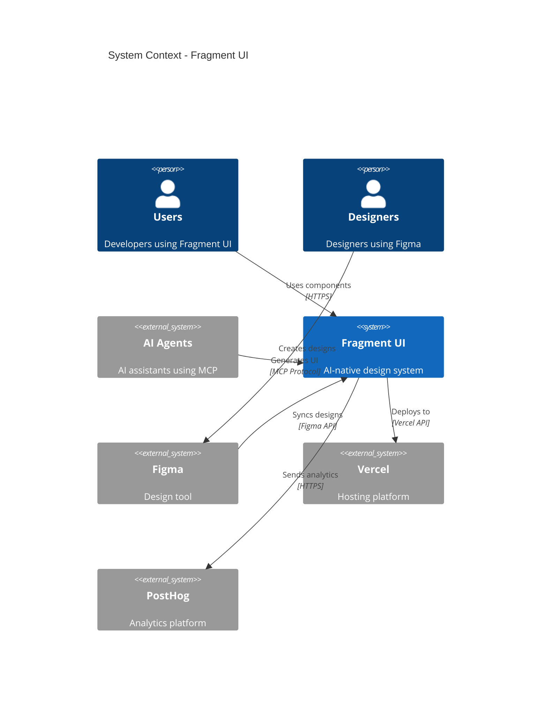
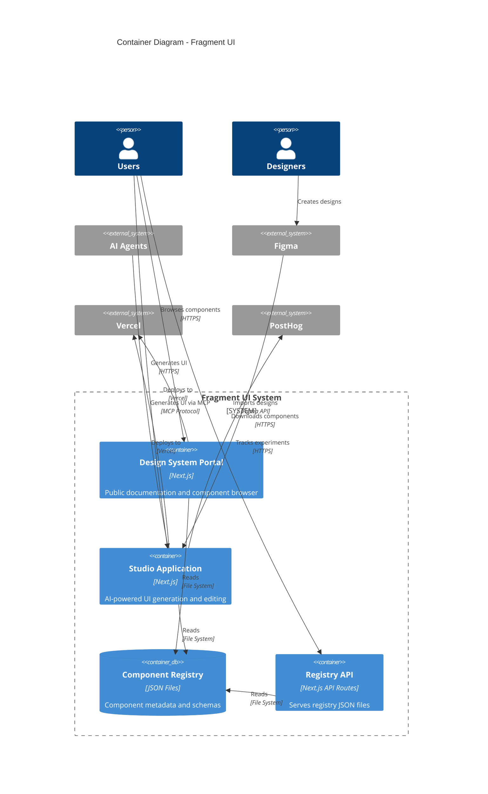

# System Overview

**Purpose:** High-level system architecture using C4 model  
**Audience:** All engineers, stakeholders  
**When to read:** First architecture document to read

---

## C4 Context Diagram



---

## Container Diagram



---

## Component Diagram - Studio Application

```mermaid
C4Component
    title Component Diagram - Studio Application

    Container(studio, "Studio Application", "Next.js")
    
    Component_Boundary(studioApp, "Studio App") {
        Component(chat, "Chat Interface", "React", "Conversational UI generation")
        Component(dslGen, "DSL Generator", "TypeScript", "Generates UI-DSL from prompts")
        Component(patch, "Patch Service", "TypeScript", "Applies patches to DSL")
        Component(codegen, "Code Generator", "TypeScript", "Converts DSL to TSX")
        Component(preview, "Preview Service", "React", "Renders preview")
        Component(submissions, "Submissions Service", "TypeScript", "Manages review workflow")
        Component(experiments, "Experiments Service", "TypeScript", "A/B testing")
    }
    
    System_Ext(openai, "OpenAI API")
    System_Ext(posthog, "PostHog")
    SystemDb(registry, "Component Registry")
    
    Rel(chat, dslGen, "Sends prompt")
    Rel(dslGen, openai, "Calls API")
    Rel(dslGen, patch, "Applies patches")
    Rel(patch, codegen, "Generates code")
    Rel(codegen, preview, "Renders")
    Rel(submissions, registry, "Validates against")
    Rel(experiments, posthog, "Tracks events")
```

---

## Key System Characteristics

### 1. Monorepo Architecture

- **Single Repository:** All packages and apps in one repo
- **Shared Tooling:** Common build, test, lint configs
- **Atomic Changes:** Changes across packages in single commit

### 2. Code-First Distribution

- **Registry JSON:** Component metadata in JSON files
- **User Ownership:** Users install and own component code
- **No Version Conflicts:** Each project has its own copy

### 3. AI-Native Design

- **UI-DSL:** Intermediate representation for AI generation
- **Patch System:** Conversational editing without full regeneration
- **MCP Integration:** AI agents can interact via Model Context Protocol

### 4. Domain-Driven Design

- **Bounded Contexts:** Studio, Library, Drafts, Releases, Experiments, Governance
- **Domain Events:** Event-driven communication between modules
- **Shared Domain Model:** Asset, Revision, Patch, CheckResult, Experiment

---

## Technology Stack

| Layer | Technology |
|-------|-----------|
| **Runtime** | Node.js 20, React 18, Next.js 15 |
| **Build** | Turborepo, esbuild, Vite |
| **Package Manager** | pnpm 9.0.0 |
| **Testing** | Vitest, Playwright, Chromatic |
| **Linting** | ESLint 9, custom Design System rules |
| **CI/CD** | GitHub Actions |
| **Deployment** | Vercel (Next.js apps) |
| **AI Integration** | OpenAI API, MCP Protocol |
| **Analytics** | PostHog |

---

## Data Flow

### Component Installation Flow

```
User → Registry API → Registry JSON → CLI → User's Project
```

### Studio Generation Flow

```
User Prompt → Chat → DSL Generator → UI-DSL → Code Generator → TSX → Preview
```

### Submission Workflow

```
Draft Revision → Submission → Quality Checks → Review → Approval → Release
```

---

## Security Considerations

- **No Authentication:** Public registry (read-only)
- **Studio:** May require auth in production (TODO: verify)
- **API Keys:** OpenAI, PostHog keys in environment variables
- **No PII:** Component code doesn't contain personal data

---

## Scalability

- **Horizontal Scaling:** Next.js apps can scale on Vercel
- **Static Assets:** Registry JSON files are static (CDN-cached)
- **Database:** Currently file-based, may need DB for scale (TODO: verify)

---

## Next Steps

- [Monorepo Structure](./monorepo-structure.md) - Package organization
- [Domain Model](./domain-model.md) - Core entities
- [Module Boundaries](./module-boundaries.md) - Studio modules
- [Data Flow](./data-flow.md) - Detailed data flows

---

## Gotchas

- **Build Order:** Some packages must be built before others
- **Hot Reload:** Package changes require rebuild for apps
- **TypeScript:** Shared `tsconfig.base.json` for all packages
- **Testing:** Tests run in parallel via Turborepo

---

**Last Updated:** 2025-01-XX

