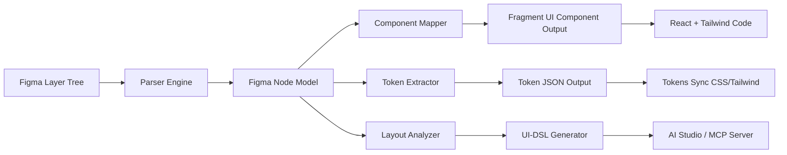

# Fragment UI — Figma Plugin

**Technical Documentation**

**Version:** 0.1.0 (Technical Preview / Proof of Concept)  
**Author:** Błażej Rzepa  
**Status:** Early R&D. Core features implemented. Advanced features (codegen, AI refinement, patching) are conceptual or partial.

---

## 1. Purpose & Goals

The Fragment UI Figma Plugin provides a structured, deterministic pipeline for converting Figma designs into production-ready code based on:

- **Fragment UI Component Library** (React + Tailwind)
- **Fragment UI Blocks** (Dashboard, Forms, Layouts)
- **Fragment Tokens** (colors, radius, spacing, typography)
- **UI-DSL** (Fragment Domain-Specific Language for AI Studio)

The key design principle behind the plugin is:

> **"Design in Figma → Generate DSL & code scaffolding → Refine using AI Studio → Produce ready-to-ship Fragment UI components."**

The plugin does **NOT** attempt full speculative design-to-code. Instead, it focuses on structured extraction, accurate mapping, and deterministic conversion.

---

## 2. High-Level Architecture



---

## 3. Core Functional Modules

Plugin consists of 5 main modules.

### 3.1. Parser Engine

Responsible for analyzing the layer tree in Figma.

**Input:**
- `FigmaNode[]` from Figma Plugin API
- `style` (fills, textStyles, effects)
- `autolayout`
- `constraints`

**Output:**
- `NormalizedNode[]` → unified model, independent of Figma

**Transformation:**

```typescript
interface NormalizedNode {
  id: string;
  type: "frame" | "text" | "vector" | "instance" | "component";
  layout: LayoutProps;
  style: StyleProps;
  children: NormalizedNode[];
}
```

Parser handles:
- layout (AutoLayout horizontal/vertical)
- padding / gap
- text styles
- corner radius
- primitive fills
- visibility
- variants (Figma Components / Properties)

### 3.2. Component Mapper

Module matching Figma nodes → Fragment UI components.

**Mapping Examples:**

| Figma structure | Fragment UI component |
|----------------|---------------------|
| AutoLayout row with text + icon | `<Button>` |
| Text field container | `<Input>` |
| Select menu | `<Select>` |
| Card (shadow, padding, radius) | `<Card>` |
| Frame with header + body | `<PageShell>` / `<DashboardShell>` |
| Table-like rows | `<DataTable>` |

**Mapping Logic:**

```typescript
if (node.type === "component" && node.name.includes("Button")) {
  return "<Button variant=\"default\">" + text + "</Button>";
}
```

### 3.3. Token Extractor

Extracts color, spacing, radius, typography values from Figma and maps them to:

- Fragment UI tokens (JSON)
- Tailwind config overrides
- CSS variables (`:root { --radius: 8px; ... }`)

**Example Generated Tokens:**

```json
{
  "colors": {
    "primary": "#1a73e8",
    "secondary": "#6b7280"
  },
  "radius": {
    "sm": "4px",
    "md": "8px"
  }
}
```

If values don't exist in the codebase system:
- Marked as "unmapped"
- Plugin suggests closest existing token

### 3.4. Layout Analyzer

Module responsible for converting layout structures:

- AutoLayout → Flexbox
- Min/max width → Tailwind utilities
- Stacking → z-index + flex-col / flex-row
- Grids → CSS grid (if deterministic)

**Example:**

**Figma:**
- AutoLayout vertical
- Gap: 16
- Padding: 24
- Alignment: start

**Output:**
```tsx
<div className="flex flex-col gap-4 p-6 items-start">
  {children}
</div>
```

### 3.5. UI-DSL Generator

Key part of AI Studio integration.

Based on the unified model, DSL code is generated:

```
Component Dashboard {
  Sidebar width=280 {
    NavItem("Home")
    NavItem("Analytics")
  }
  Content {
    Header("Dashboard")
    Card {
      Title("Revenue")
      Chart(type="line")
    }
  }
}
```

DSL is then:
- Sent to MCP server
- Processed by AI Studio
- Converted to Fragment UI code (TSX)

---

## 4. Plugin Capabilities

### 4.1. Supported Features

| Feature | Status | Notes |
|---------|--------|-------|
| Basic components mapping | ✔ Implemented | Buttons, Inputs, Cards, Text |
| Layout extraction | ✔ Implemented | Padding, spacing, autolayout |
| Token extraction | ✔ Implemented | Colors, radius, typography |
| Block-level export | ✔ Partial | Dashboard/Forms require structure |
| DSL export | ✔ Implemented | Working for standard patterns |
| AI Studio integration | ✔ Partial | DSL → MCP works |
| Codegen TSX | ⚠ Concept | Not fully implemented |
| Patch editing | ⚠ Concept | Depends on AI Studio runtime |
| Bi-directional sync | ⚠ Planned | Figma → Code + Code → Figma |

### 4.2. Outputs

Plugin generates three types of outputs:

**1) Code Output (TSX)** — for simple components

```tsx
export function Example() {
  return (
    <Card className="p-6">
      <h2 className="text-xl font-medium">Welcome</h2>
      <Button variant="outline">Get Started</Button>
    </Card>
  );
}
```

**2) Tokens Output (JSON)** — for synchronization

```json
{
  "colors": {
    "primary": "#0F172A"
  },
  "radius": {
    "md": "8px"
  }
}
```

**3) DSL Output (Fragment UI DSL)** — for AI Studio

```
Form "New User" {
  Input("Name")
  Input("Email")
  Button("Create User", variant="primary")
}
```

---

## 5. Internal Architecture

**Folder Structure (plugin repo):**

```
fragment-ui-figma-plugin/
  src/
    plugin/          ← backend worker (Figma env)
      index.ts
      parser/
        normalize.ts
        inspect.ts
      mapping/
        components.ts
        infer.ts
      tokens/
        extract-colors.ts
        extract-radius.ts
      layout/
        autolayout.ts
        spacing.ts
      dsl/
        generate-dsl.ts
        builders.ts
      mcp/
        send-to-mcp.ts
      utils/
        types.ts
        helpers.ts
    ui/              ← plugin UI panel
      index.html
      App.tsx
      components/
        Button.tsx
        CodeBlock.tsx
  dist/
  manifest.json
  README.md
```

---

## 6. Error Handling & Validations

Plugin has validations:

- **Token mismatch**: If Figma token ≠ Fragment token → warning + suggestion
- **Unsupported component**: Returns DSL-only output
- **Unsafe layout**: Warn: "AutoLayout mixed directions — fallback to absolute"
- **Missing text nodes**: Warn: "Missing label for button-like shape"

---

## 7. Performance Considerations

- Parser runs in O(n) over layer tree
- Token extraction runs only on root level
- DSL generation is linear
- Does not use AI inside plugin — integration is with MCP outside Figma

---

## 8. Limitations (Technical Preview)

- Does not generate full code for complex components
- Patching works only in AI Studio (outside plugin)
- Does not support Figma prototype interactions
- No full bidirectional synchronizer
- Mapping requires standardized design (naming conventions)

---

## 9. Roadmap

### 0.2.0 (Next)
- TSX codegen engine
- Metadata attachments to Figma nodes
- Improved mapping heuristics

### 0.3.0
- Full block-level detection
- Component variants
- CLI for auto-import

### 0.4.0
- Bi-directional sync
- "Pull code into Figma" preview
- DSL annotations in Figma

### Long-term Vision
- Fully AI-assisted design-to-code pipeline
- Automated patch integration
- Multi-brand design system sync

---

## 10. Integration With Fragment UI Ecosystem

Plugin works with:

- **Fragment Tokens** → mapping colors/radius
- **Fragment Blocks** → interpretation of dashboard layouts
- **Fragment UI DSL** → export to AI Studio
- **MCP Server** → interpretation and code generation
- **CLI Tools** → import to project

---

## 11. Development Guidelines

### For Copilot / AI Assistants

See [FIGMA_PLUGIN_COPILOT_GUIDELINES.md](./FIGMA_PLUGIN_COPILOT_GUIDELINES.md) for complete implementation guidelines.

**Key Requirements:**
- TypeScript strict mode
- Modular architecture (parser ≠ mapping ≠ DSL)
- JSDoc on all exported functions
- Unit tests for parser and DSL generation
- Integration with existing MCP server (localhost:8765)

---

**Last Updated:** 2025-01-XX  
**Status:** Planning / Ready for Implementation

