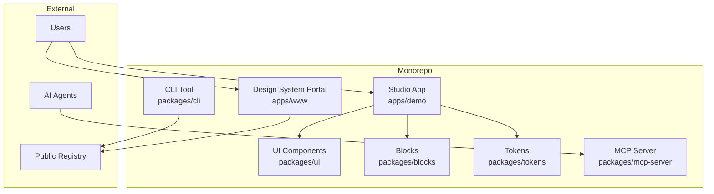

# Architecture Overview

**Purpose:** High-level understanding of Fragment UI system  
**Audience:** All engineers  
**When to read:** After quick start, before deep development

---

## System Architecture



---

## Core Concepts

### 1. Monorepo Structure

Fragment UI uses a **pnpm workspace monorepo** with:

- **Packages:** Reusable libraries (UI, blocks, tokens, CLI, etc.)
- **Apps:** Applications (Portal, Studio)
- **Shared Tooling:** Build scripts, configs, tests

**Key Benefit:** Single source of truth, atomic changes across packages.

---

### 2. Code-First Distribution

Components are distributed via **registry JSON files**:

```
https://fragment-ui.dev/r/button.json
```

Users install via:
```bash
npx shadcn@latest add https://fragment-ui.dev/r/button.json
```

**Key Benefit:** Users own the code, can customize freely.

---

### 3. AI-Native Architecture

**Studio** enables AI-powered UI generation:

1. **Prompt** → Intent detection
2. **Intent** → UI-DSL (Domain-Specific Language)
3. **UI-DSL** → TSX code generation
4. **TSX** → Preview rendering

**Key Services:**
- `ChatOrchestrator` - Manages conversation context
- `DslService` - Generates and validates DSL
- `CodegenService` - Converts DSL to TSX
- `PatchService` - Enables conversational editing

---

### 4. Domain-Driven Design

Studio follows **DDD principles** with clear module boundaries:

- **Studio (Create)** - AI generation + editing
- **Library (Reuse)** - Component catalog
- **Drafts (Review)** - Submissions workflow
- **Releases (Ship)** - Versioning + publishing
- **Experiments (Measure)** - A/B testing
- **Governance (Scale)** - Policies + compliance

**Key Benefit:** Clear responsibilities, testable modules.

---

## Package Responsibilities

| Package | Purpose | Key Exports |
|---------|---------|-------------|
| `@fragment_ui/ui` | UI components | 63+ components |
| `@fragment_ui/blocks` | Screen compositions | Dashboard, Forms, etc. |
| `@fragment_ui/tokens` | Design tokens | Colors, spacing, etc. |
| `@fragment_ui/registry` | Component registry | Registry JSON schema |
| `@fragment_ui/cli` | CLI tool | `ds add`, `ds patch` |
| `@fragment_ui/mcp-server` | MCP server | AI agent integration |
| `@fragment_ui/ui-dsl` | DSL types | UI-DSL v2 schema |

---

## Data Flow

### Component Installation Flow

```
User runs: npx shadcn add https://fragment-ui.dev/r/button.json
  ↓
CLI fetches registry JSON
  ↓
CLI downloads component files
  ↓
CLI installs dependencies
  ↓
Component ready to use
```

### Studio Generation Flow

```
User prompt: "Create a login form"
  ↓
ChatOrchestrator detects intent
  ↓
DslService generates UI-DSL
  ↓
CodegenService converts to TSX
  ↓
PreviewService renders preview
  ↓
User can edit via patches
```

---

## Technology Stack

- **Runtime:** Node.js 20, React 18, Next.js 15
- **Build:** Turborepo, esbuild, Vite
- **Testing:** Vitest, Playwright, Chromatic
- **Linting:** ESLint 9, custom Design System rules
- **Package Manager:** pnpm 9.0.0
- **CI/CD:** GitHub Actions

---

## Key Design Decisions

1. **Monorepo:** Single repo for all packages enables atomic changes
2. **Code-First:** Users own code, not locked into framework
3. **AI-Native:** Built for AI-assisted development from ground up
4. **Domain-Driven:** Clear module boundaries prevent "feature soup"
5. **Type-Safe:** Full TypeScript coverage, Zod schemas for validation

---

## Next Steps

- [Monorepo Structure](../architecture/monorepo-structure.md) - Deep dive into package organization
- [Domain Model](../architecture/domain-model.md) - Core entities and relationships
- [Module Boundaries](../architecture/module-boundaries.md) - Studio module architecture

---

## Gotchas

- **Build Order:** Some packages depend on others (tokens → ui)
- **Hot Reload:** Changes in packages require rebuild for apps
- **TypeScript:** All packages use shared `tsconfig.base.json`
- **Testing:** Tests run in parallel via Turborepo

---

**Last Updated:** 2025-01-XX

